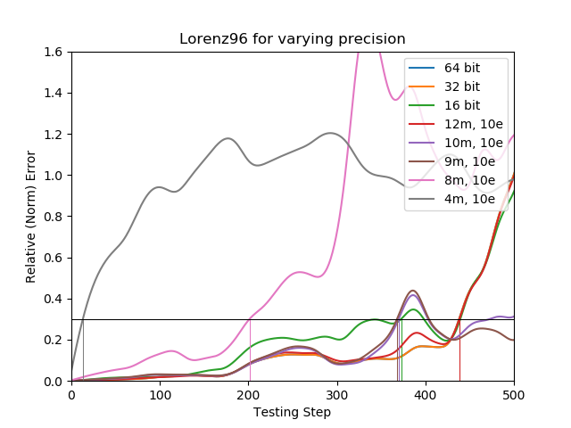
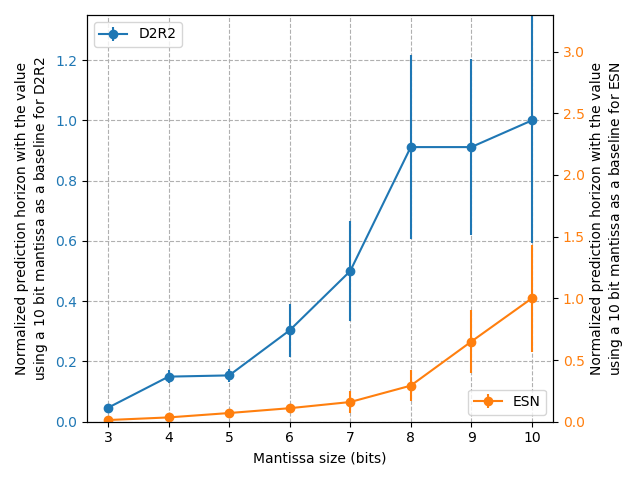

## File descriptions:

- `LSTM/LSTM_Paper_Code_Table_min.py`
  - Uses the earlier LstmModel and `default_lstm.json` for training, so run from the folder containing the `default_lstm.json` and the folder `script/model_lstm.py`.
  - Trains three models with 16, 32 and 64-bit precision and evaluates it on the set of hard-coded test ICs.
  - Generates the comparison error plot and dumps the data and the trained models
  - LSTM floating point precision comparison example
     

- `ESN/ESN_Paper_Code_Table_min.py`
  - Runs training and evaluation for ESN or D2R2 on 16, 32 and 64 data, as well as on data with truncated mantissas.
  - Main function defines following parameters:
    - offsets - offsets of test ICs following the end of the training set
    - do_fourier - should the script calculate and store the fourier modes of the data
    - mantissas - list of truncating mantissa lengths
    - exponents - list of exponent sizes
    - d2r2/esn - run D2R2 or ESN
  - Dumps all of the generated data and produces the error plot comparing different precisions
  - ESN floating point precision comparison example
     

- `ESN/lorenz96_correlation.py`
  - Generates the graph comparing ESN and D2R2 Prson's correlation coefficients to the original data
  - Uses the data files dumped by the previous scripts

- `ESN/draw_red_plot.py`
  - Bunch of messy plotting functions called as needed at the end of the file, using dumped data files from the previous scripts.
  - You can find the one you need by searching for the name of the saved graph form the attached folder.
  - ESN-D2R2 prediction horizon comparison
     
